# OBservator 🚀

**OBservator**에 오신 것을 환영합니다!  
이 서비스는 머신러닝 모델을 기반으로 가상화폐 가격 변동을 예측하고, 자동으로 거래를 실행합니다.  
**LSTM 신경망**을 활용하여 시장 데이터를 분석하고 실시간으로 유용한 매매 통찰을 제공합니다.

👉[**_서비스 바로가기_**](https://observator.co.kr/)

## 📜 **주요 기능**

### End-to-End 워크플로우

- **데이터 수집**: Upbit API를 통해 오더북(Orderbook) 및 거래(Ticks) 데이터를 자동으로 가져와 전처리.
- **특성 추출**: 가격 스프레드, 중간 가격, 오더북 불균형, 가격 변동성, 매수/매도 비율 등 핵심 특성 추출.
- **모델 학습**: 하이퍼파라미터 튜닝과 조기 종료를 적용하여 LSTM 모델을 학습.
- **자동 매매**: 모델의 예측 결과와 사용자가 설정한 임계값에 따라 실시간으로 BUY/SELL 명령 실행.

### 사용자 맞춤 기능

- **회원가입 및 로그인**: 사용자들은 웹사이트에서 간편하게 회원가입과 로그인을 할 수 있으며, Upbit API 키를 등록해 시스템과 연동 가능.
- **실시간 대시보드**: 웹사이트 대시보드를 통해 가상화폐의 실시간 정보(현재 가격, 호가창, 체결 정보 등)와 관련 뉴스를 한눈에 확인 가능.
- **임계값 설정**: 대시보드에서 사용자 지정 임계값을 설정해 자동 매매 전략을 세부적으로 조정 가능.
- **자동매매 제어**: 대시보드에서 **자동매매 시작/중지 버튼**을 통해 간단히 거래 실행 여부를 제어할 수 있음.
- **24시간 모델 업데이트**: 시스템은 매일 24시간마다 수집된 새로운 데이터를 기반으로 기존 모델을 재학습하며, 가장 성능이 우수한 모델로 자동 업데이트하여 실시간 예측 정확도를 지속적으로 향상시킴.

### 모듈화 및 확장 가능

- 각 구성 요소를 독립적으로 실행할 수 있도록 설계.
- 거래 매개변수, 데이터 입력, 모델 설정 등을 동적으로 구성 가능.

### 실시간 실행

- 지속적인 소켓 연결을 통해 실시간 데이터 스트림 처리.
- 효과적인 거래 전략을 위한 실시간 임계값 변경 지원.

### 로깅 및 디버깅

- 모든 스크립트에서의 상세 로깅으로 추적 및 디버깅 용이.
- 테스트 손실 및 성능 지표 저장으로 향후 분석 가능.

## 구현결과

### 1. 로그인 화면  

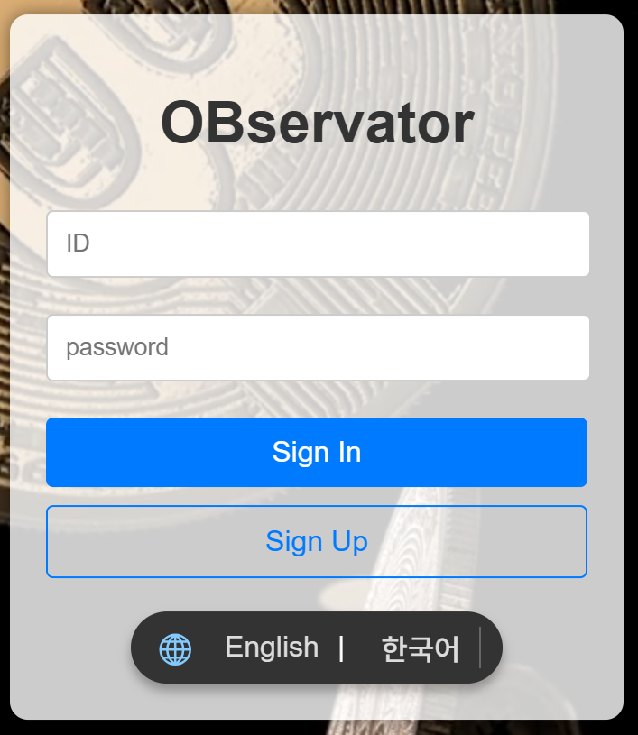 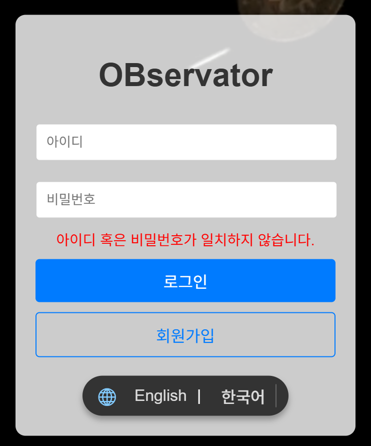  

### 2. 회원가입 화면 & 이용약관 팝업  

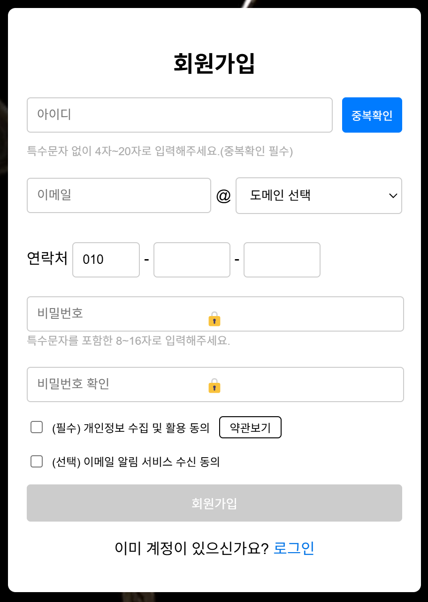  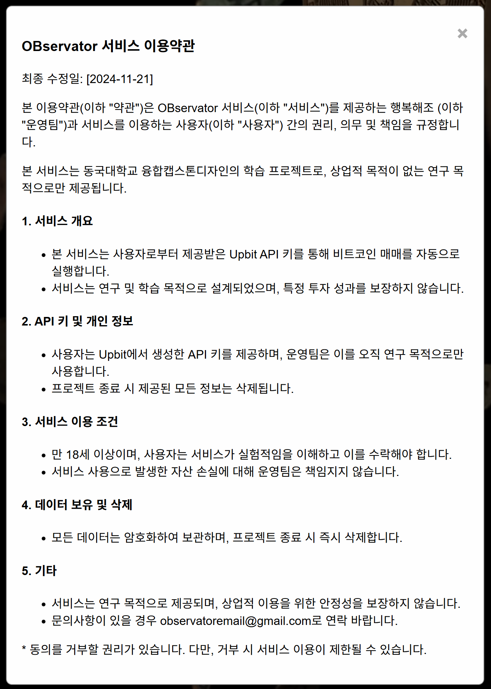  

### 3. 홈 화면 & 네비게이션 바  

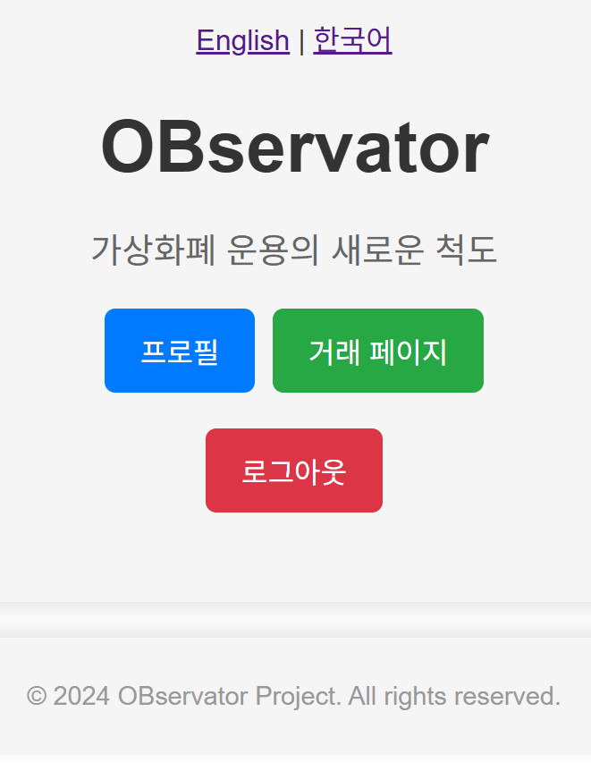  

### 4. 프로필 화면 & Upbit API 발급방법 팝업

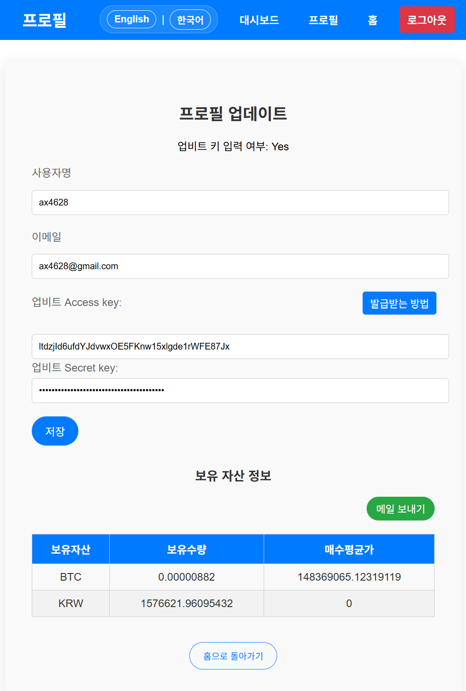 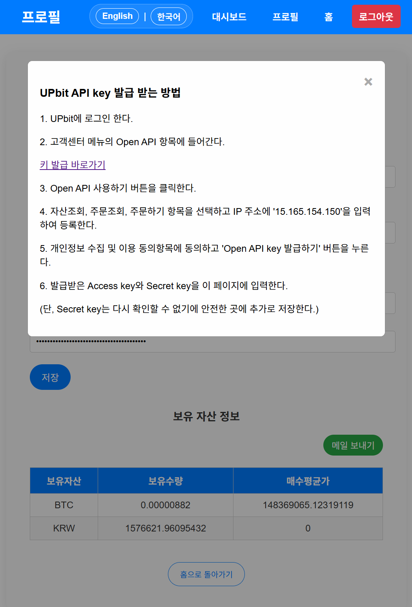 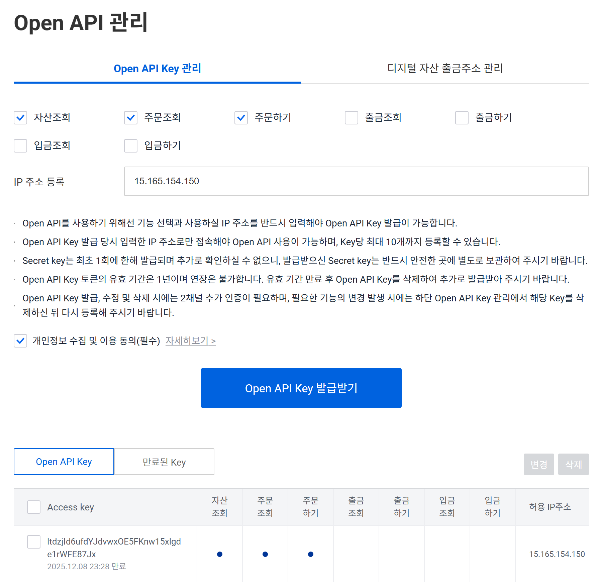  

### 5. 대시보드 화면

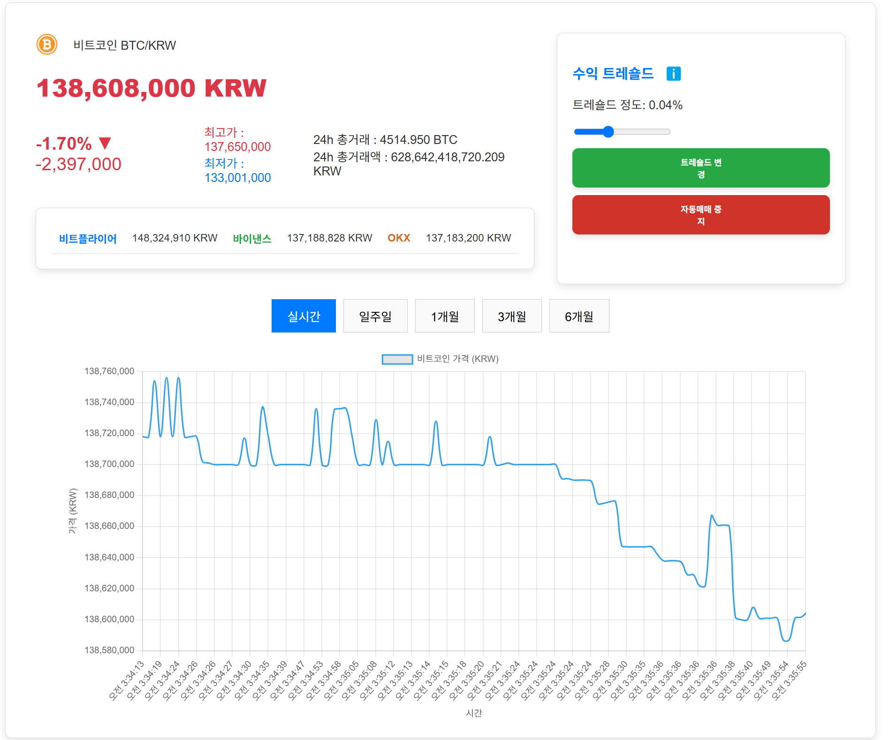 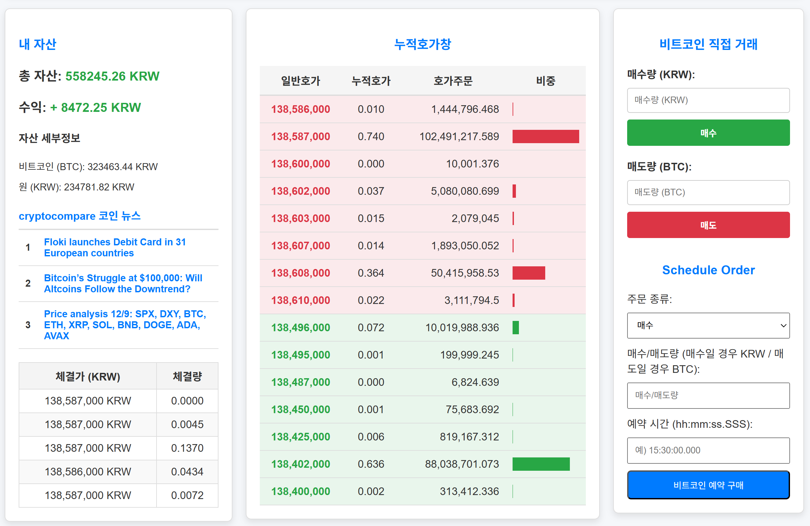  

## 개발 환경

### OS

### Code Editor

### Collaboration Tool

## 프로그래밍 언어 & 프레임워크

### FE

### BE

  
  
  

### ML

  

## 시스템 구성도

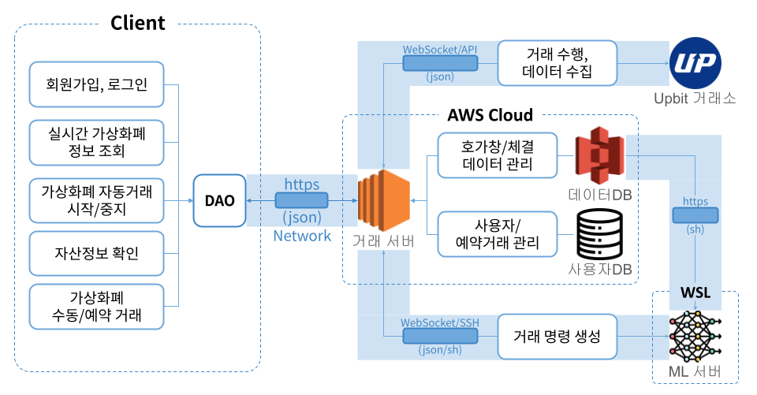

이 시스템 구성도는 OBservator의 전체 아키텍처를 나타낸다. 시스템은 크게 Client와 AWS Cloud, WSL, Upbit 거래소로 구성된다.

- **_Mobile Client_**

  - **회원가입, 로그인:** 사용자는 Client(웹/앱)를 통해 회원가입 및 로그인을 할 수 있다.
  - **실시간 가상화폐 정보 조회:** 사용자는 자신의 패션 성향 유형을 확인하고, 이에 맞는 스타일 추천을 받을 수 있다.
  - **가상화폐 자동거래 시작/중지:** 사용자는 선호하는 스타일을 선택하여 저장하고, 저장된 스타일을 조회할 수 있다.
  - **가상화폐 수동/예약거래:** 사용자가 추천받은 스타일을 선택하여 직접 구매할 수 있는 기능을 제공한다.
  - **자산정보 확인:** 사용자가 추천받은 스타일을 선택하여 직접 구매할 수 있는 기능을 제공한다.

- **_AWS Cloud_**

  - **EC2:** 이미지 데이터를 저장하는 데 사용된다. 이미지 등록 페이지를 통해 업로드한 이미지 데이터는 이곳에 안전하게 저장된다.
  - **S3:** 사용자 데이터와 이미지 데이터의 메타데이터를 저장한다. 사용자의 패션 성향 유형 및 선호 스타일 등의 데이터를 관리한다.
  - **RDS:** 사용자의 인증 및 권한 관리를 담당한다. 사용자는 Firebase를 통해 안전하게 로그인하고 자신의 데이터를 관리할 수 있다.

- **_WSL_**

  - **ML서버:** ㅁㅁ

- **Upbit 거래소**

  - **ML서버:** ㅁㅁ

## 기대효과

1. **투자 진입장벽 감소:** 복잡한 가상화폐 시장의 데이터를 분석하고 자동 매매 서비스를 제공하여 초보 투자자도 쉽게 접근할 수 있도록 지원합니다. 사용자 친화적인 대시보드와 간단한 설정만으로 투자 관리를 시작할 수 있습니다.

2. **낮은 투자 손실률:** 실시간 데이터 분석과 머신러닝 모델을 통해 투자 의사결정을 자동화함으로써 감정에 의존한 투자에서 벗어나 손실률을 줄이고 안정적인 수익률을 기대할 수 있습니다.

3. **자동화된 매매:** 사용자가 설정한 임계값에 따라 24시간 자동으로 매매를 수행하므로, 시장의 변동성을 놓치지 않고 항상 최적의 타이밍에 대응할 수 있습니다.

4. **확장성:** 다양한 가상화폐 시장 및 새로운 거래소와의 통합이 가능하도록 설계되었습니다. 또한, 정기적인 모델 업데이트를 통해 새로운 데이터와 시장 상황에 맞는 예측 성능을 유지합니다.  

## 프로젝트 산출물

| 분류 |  산출물  |
| :---: | :---: |
| 수행 | [수행계획서](Doc/1_1_OSSProj_01_버스태워조_수행계획서.md)🔹[수행계획 발표자료](Doc/1_2_OSSProj_01_버스태워조_수행계획발표자료%20.pdf) |
| 중간 | [중간보고서](Doc/2_1_OSSProj_01_버스태워조_중간보고서.md)🔹[중간발표자료](Doc/2_2_OSSProj_01_버스태워조_중간발표자료.pdf)|
| 최종 | [최종보고서](Doc/3_1_OSSProj_01_버스태워조_최종보고서.md)🔹[최종발표자료](Doc/3_2_OSSProj_01_버스태워조_최종발표자료.pdf)|
| 기타 | [제품구성&배포운영자료](Doc/4_3_OSSProj_01_버스태워조_제품구성배포운영자료.md)🔹[Overview](Doc/4_4_OSSProj_01_버스태워조_Overivew.md)🔹[범위&일정&이슈관리](Doc/4_1_OSSProj_01_버스태워조_범위_일정_이슈관리.md)🔹[회의록](Doc/4_2_OSSProj_01_버스태워조_회의록.md) |

## 🤝 **Team&Members**

> 팀명: 버스태워조

  | 역할 |  성명  |
  | :---: | :---: |
  | 멘토 | **진대한** |
  | ML&팀장 | **김민재** |
  | FE | **이보성** |
  | BE | **권일준**, **이승호** |

## 라이선스

이 프로젝트는 MIT 라이선스에 따라 라이선스가 부여됩니다. 자세한 내용은 [LICENSE](LICENSE) 파일을 참조하세요.
